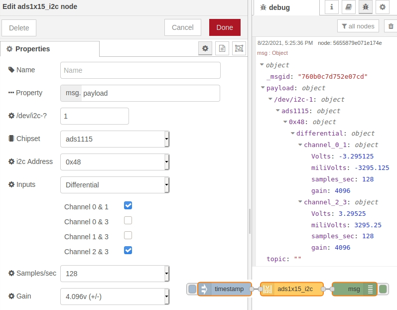

node-red-contrib-ads1x15_i2c
==================================


<a href="http://nodered.org" target="_new">Node-RED</a> A node-red node providing access to a ADS1x15 I2C analog to digital converter using a raspberry pi.

---

## Table of Contents
* [Install](#install)
* [Usage](#usage)
  * [Name](#Name)
  * [Property](#Property)
  * [Chipset](#Chipset)
  * [i2c_Address](#i2c_Address)
  * [Channel](#Channel)
  * [Samples](#Round_Output)
  * [Gain](#Gain)
* [Bugs / Feature request](#bugs--feature-request)
* [License](#license)
* [Work](#work)
* [Contributor_of_Project](#Contributor_of_Project)

---

## Install

Install with node-red Palette Manager or,

Run the following command in your Node-RED user directory - typically `~/.node-red`:

```
npm install node-red-contrib-ads1x15_i2c
```


## Usage

To get a voltage or difference of voltage from a ADS1115 or ADS1015 analog to digital converter just select the correct setting for your device and trigger the node.




### Name

Define the msg name if you wish to change the name displayed on the node.

### Property

Define the msg property name you wish. The name you select (msg.example) will also be the output property</p>
The payload must be a number! Anything else will try to be parsed into a number and rejected if that fails.

### Chipset

The Chipset by default is set to 1115. The Chipset is the version of ads supported. If you have an ads1015 select that option.

### i2c_Address

The Address by default is set to 0x48. You can setup the ADS1X15 with one of four addresses, 0x48, 0x49, 0x4a, 0x4b. Please see ads1X15 documentation for more information

### Inputs

Inputs may be used for Single-ended measurements (A0-GND) or Differential measurements (A0-A1). Single-ended measurements measure voltages relative to a shared reference point which is almost always the main units ground. Differential measurements are “floating”, meaning that it has no reference to ground. The measurement is taken as the voltage difference between the two wires. Example: The voltage of a battery can be taken by connecting A0 to one terminal and A1 to the other.

### Samples

Select the sample per second you want your ADS to make. Higher rate equals more samples taken before being averaged and sent back from the ADS. Please see ads1X15 documentation for more information

### Gain

I  Select the Gain you want. To increase accuracy of smaller voltage signals, the gain can be adjusted to a lower range. Do NOT input voltages higher than the range or device max voltage, pi 3.3v use a voltage devider to lower input voltages as needed.


## Bugs / Feature request
Please [report](https://github.com/meeki007/node-red-contrib-ads1x15_i2c/issues) bugs and feel free to [ask](https://github.com/node-red-contrib-ads1x15_i2c/issues) for new features directly on GitHub.


## License
This project is licensed under [Apache 2.0](http://www.apache.org/licenses/LICENSE-2.0) license.


## Work
_Need a node?
_Need automation work?
_Need computers to flip switches?

Contact me at meeki007@gmail.com


## Contributor_of_Project

Thanks to [Kevin Felix D Rodriguez Perez AKA felixdrp](https://github.com/felixdrp/ads1x15) for his work on ads1x15. It made making this node for node-red possible.
<br>

## release notes ##
0.0.0 = (majorchange) . (new_feature) . (bugfix-simple_mod)

version 0.0.11
<br>
First Public release
<br>
<br>
